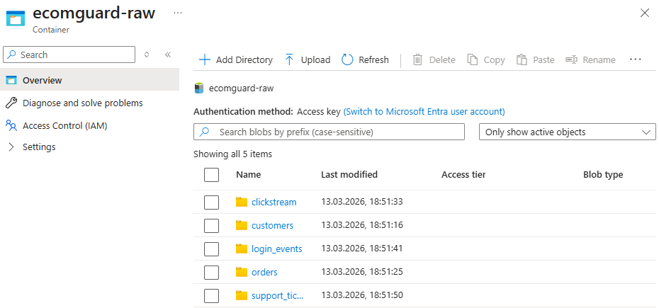

# 🛡️ EcomGuard

> A production-grade **Security, Compliance & Observability Platform** for e-commerce — built on Azure, Databricks, Kafka, and Kubernetes.

EcomGuard simulates a fictional e-commerce company and provides a full data platform that monitors it for security threats, compliance violations, and operational health — all from one place.

---

## 🎯 Project Goals

- Demonstrate end-to-end data engineering on a modern cloud stack
- Apply real-world **GDPR** compliance patterns (PII masking, audit log, right to erasure)
- Implement **MTTD** (Mean Time To Detect) via real-time anomaly detection
- Implement **MTTR** (Mean Time To Recover) via incident lifecycle tracking
- Show **Observability** best practices — structured logs, metrics, traces
- Expose a **Secure web dashboard** following OWASP guidelines
- Stream events in real time using **Apache Kafka**
- Run microservices on **Kubernetes** (local minikube → AKS on Azure)

---

## 🏗️ Architecture

```
┌─────────────────────────────────────────────────────────────┐
│                    Kubernetes (AKS / minikube)               │
│                                                             │
│   ┌──────────────────┐    ┌──────────────────┐             │
│   │  order-service   │    │   auth-service   │             │
│   │  (Python/Flask)  │    │  (Python/Flask)  │             │
│   └────────┬────────┘    └────────┬─────────┘             │
│            │                       │                         │
└────────────┼──────────────────────┼─────────────────────────┘
             │                       │
             ▼                       ▼
┌─────────────────────────────────────────────────────────────┐
│              Apache Kafka (Confluent Cloud)                  │
│                                                                │
│   [orders topic]    [login-events topic]   [clicks topic]   │
└─────────────────────────────┬───────────────────────────────┘
                              │
                                ▼
┌──────────────────────────────────────────────────────────────┐
│              Databricks (Azure) — Structured Streaming        │
│                                                                │
│   ┌──────────────┐  ┌──────────────┐  ┌─────────────────┐  │
│   │ GDPR Layer   │  │  Detection   │  │  Incident Track  │  │
│   │ PII Masking  │  │ Anomaly/MTTD │  │     MTTR        │  │
│   └─────────────┘  └──────────────┘  └─────────────────┘  │
│                                                                │
│              Delta Lake (Azure Data Lake Gen2)              │
└─────────────────────────────────────────────────────────────┘
                              │
                              ▼
┌─────────────────────────────────────────────────────────────┐
│          Secure Web Dashboard + Azure Monitor                │
│          (Observability: logs, metrics, traces)              │
└─────────────────────────────────────────────────────────────┘
```

---

## 📦 Stack

| Layer | Technology |
|---|---|
| Microservices | Python / Flask on Kubernetes |
| Event Streaming | Apache Kafka (Confluent Cloud free tier) |
| Data Processing | Databricks + Structured Streaming |
| Storage | Delta Lake on Azure Data Lake Gen2 |
| GDPR Compliance | PII masking, audit log, erasure simulation |
| Anomaly Detection | MTTD — real-time login & fraud detection |
| Incident Tracking | MTTR — lifecycle timers and SLA tracking |
| Observability | Azure Monitor, structured logging |
| Frontend | Secure web dashboard (OWASP) |
| IaC | Terraform *(Phase 4 — planned)* |

---

## 📁 Project Structure

```
ecomguard/
├── data_generation/     # Synthetic e-commerce data factory (Faker)
├── ingestion/           # Pipeline code — batch and streaming
├── processing/          # Databricks notebooks — transforms, Delta Lake
├── compliance/          # GDPR — PII masking, audit log, right to erasure
├── detection/           # Anomaly detection logic (MTTD)
├── incidents/           # Incident lifecycle tracking (MTTR)
├── observability/       # Logging, metrics, tracing setup
├── web/                 # Secure web dashboard
└── docs/                # Architecture decisions, diagrams
```

---

## 🚀 Phases

| Phase | Focus | Status |
|---|---|---|
| **1** | Synthetic data generation + Azure Data Lake setup | ✅ Complete |
| **2** | GDPR layer + Detection (MTTD) + Incidents (MTTR) | ⏳ Planned |
| **3** | Observability + Secure web dashboard + Kafka streaming | ⏳ Planned |
| **4** | Kubernetes microservices (minikube → AKS) + IaC | ⏳ Planned |

---

## 🔒 GDPR Highlights

- Customer PII stored in a **masked layer** — raw data never exposed downstream
- Full **audit log** of every data access event
- Simulated **Right to Erasure** — delete customer records on request
- Data classification tags on all Delta Lake tables

---

## 📊 MTTD / MTTR Metrics

**MTTD scenarios:**
- Brute-force login detection (multiple failed attempts within a time window)
- Unusual order patterns (fraud signal detection)
- Geographic anomalies (login from unexpected location)

**MTTR scenarios:**
- Incident created when MTTD fires
- Resolution timer tracked in Delta Lake
- SLA breach alerts

---

## 🔗 Related Domains

This project intentionally connects knowledge from:
- **Secure Web Development** — OWASP headers, auth, input validation
- **GDPR** — data classification, PII handling, audit trails
- **MTTD / MTTR** — measurable incident response metrics
- **Observability** — structured logs, distributed traces, dashboards

---

*Built as a portfolio and learning project. All data is synthetic — generated using Python Faker.*

---

## ✅ Phase 1 Progress

### Data Generation
- 10,700 synthetic events generated across 5 event types
- 23 suspicious login events seeded for MTTD testing

| File | Records |
|---|---|
| `customers.jsonl` | 500 |
| `orders.jsonl` | 2,000 |
| `clickstream.jsonl` | 5,000 |
| `login_events.jsonl` | 3,000 |
| `support_tickets.jsonl` | 200 |

### Azure Data Lake Storage Gen2
Raw files uploaded to `ecomguard-raw` container on ADLS Gen2:



